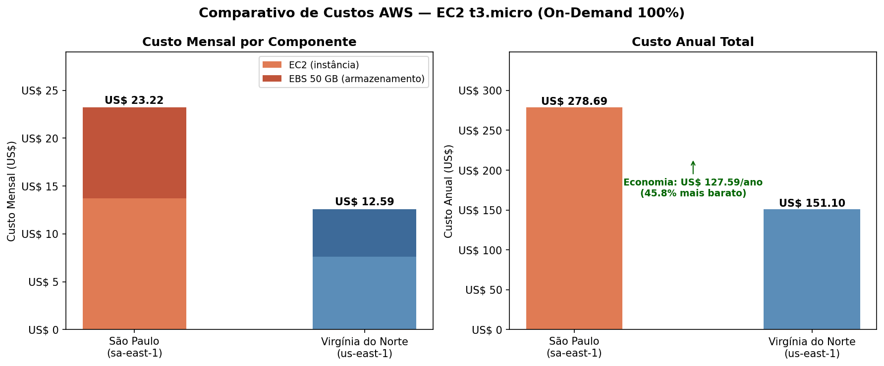

# FIAP - Faculdade de Informática e Administração Paulista

<p align="center">
<a href= "https://www.fiap.com.br/"></a>
</p>

<br>

# FarmTech Solutions — Fase 5: Machine Learning & Cloud Computing

## Grupo FarmTech Solutions

## 👨‍🎓 Integrantes: 
- <a href="https://www.linkedin.com/in/phellype-massarente-13739810a/">Phellype Matheus Giacoia Flaibam Massarente – RM566826</a>
- <a href="https://www.linkedin.com/in/carlos-costato/">Carlos Alberto Florindo Costato – RM567005</a>
- <a href="https://www.linkedin.com/in/cesar-azeredo">Cesar Martinho de Azeredo – RM568140</a>

## 👩‍🏫 Professores:
### Tutor(a) 
- <a href="https://www.linkedin.com/">Andre Godoy</a>
### Coordenador(a)
- <a href="https://www.linkedin.com/">Ana Cristina dos Santos</a>

---

## 📜 Descrição

A **FarmTech Solutions** presta serviços de Inteligência Artificial para uma fazenda de médio porte (200 hectares) que produz diversas culturas agrícolas. Neste projeto da Fase 5, desenvolvemos soluções de **Machine Learning** para análise preditiva de rendimento de safra e uma **estimativa de custos em nuvem AWS** para hospedagem da infraestrutura.

### Entrega 1 — Machine Learning: Previsão de Rendimento de Safra

Com base no dataset `crop_yield.csv`, realizamos:

1. **Análise Exploratória de Dados (EDA):** investigação das variáveis de condições de solo e temperatura relacionadas ao tipo de produto agrícola, buscando compreender distribuições, correlações e padrões nos dados.

2. **Clusterização e Detecção de Outliers (ML Não Supervisionado):** identificação de tendências de rendimento das plantações por meio de algoritmos de clusterização (K-Means, DBSCAN, etc.) e detecção de cenários discrepantes (outliers).

3. **Modelos Preditivos de Regressão (ML Supervisionado):** construção de **5 modelos preditivos** com algoritmos distintos para prever o rendimento da safra, seguindo boas práticas de projetos de Machine Learning e avaliação com métricas pertinentes.

> O notebook Jupyter completo com todo o código, análises e conclusões está disponível em: [`src/PhellypeMatheusGiacoiaFlaibamMassarente_rm566826_pbl_fase4.ipynb`](src/PhellypeMatheusGiacoiaFlaibamMassarente_rm566826_pbl_fase4.ipynb)

### Entrega 2 — Computação em Nuvem: Estimativa de Custos AWS

Estimativa de custos usando a Calculadora AWS para hospedar a Machine Learning em uma máquina Linux com as seguintes configurações:
- 2 CPUs
- 1 GiB de memória
- Até 5 Gigabit de rede
- 50 GB de armazenamento (HD)

Comparação entre as regiões **São Paulo (sa-east-1)** e **Virgínia do Norte (us-east-1)**, considerando custo On-Demand (100%), restrições legais (LGPD) e latência.

---

## 📹 Vídeos Demonstrativos

| Entrega | Vídeo | Duração |
|---------|-------|---------|
| Entrega 1 — Machine Learning | [🎬 Assistir no YouTube](https://youtube.com/LINK_DO_VIDEO_1) | ≤ 5 min |
| Entrega 2 — AWS Cloud | [🎬 Assistir no YouTube](https://youtube.com/LINK_DO_VIDEO_2) | ≤ 5 min |

---

## 📁 Estrutura de pastas

Dentre os arquivos e pastas presentes na raiz do projeto, definem-se:

- <b>.github</b>: Arquivos de configuração específicos do GitHub para gerenciar e automatizar processos no repositório.

- <b>assets</b>: Arquivos relacionados a elementos não-estruturados deste repositório, como imagens, logos e screenshots.

- <b>config</b>: Arquivos de configuração que definem parâmetros e ajustes do projeto.

- <b>document</b>: Todos os documentos do projeto, incluindo o AI Project Document. Na subpasta "other", documentos complementares.

- <b>scripts</b>: Scripts auxiliares para tarefas específicas do projeto.

- <b>src</b>: Todo o código-fonte criado para o desenvolvimento do projeto, incluindo o Notebook Jupyter com a solução completa de Machine Learning.

- <b>README.md</b>: Arquivo que serve como guia e explicação geral sobre o projeto (o mesmo que você está lendo agora).

```
📦 farmtech-solutions-fase5/
├── 📂 .github/                              ← Configurações do GitHub
├── 📂 assets/                               ← Imagens e recursos visuais
│   └── logo-fiap.png
├── 📂 config/                               ← Configurações do projeto
├── 📂 document/                             ← Documentação do projeto
│   ├── ai_project_document_fiap.md          ← Documento principal do projeto de IA
│   └── 📂 other/                            ← Documentos complementares
├── 📂 scripts/                              ← Scripts auxiliares
├── 📂 src/                                  ← Código-fonte
│   ├── PhellypeMatheusGiacoiaFlaibamMassarente_rm566826_pbl_fase4.ipynb ← Notebook Jupyter
│   └── crop_yield.csv                       ← Dataset
├── 📄 .gitignore
├── 📄 README.md                             ← Este arquivo
└── 📄 ROADMAP_FASE5.md                      ← Roadmap do projeto
```

---

## 🔧 Como executar o código

### Pré-requisitos

- **Python 3.9+**
- **Jupyter Notebook** ou **JupyterLab**
- Bibliotecas Python (listadas no notebook):
  - `pandas`, `numpy`, `matplotlib`, `seaborn`
  - `scikit-learn`, `xgboost` (opcional)

### Instalação

```bash
# 1. Clone o repositório
git clone https://github.com/Phemassa/FarmTech-FASE-5-cap1-2026.git
cd FarmTech-FASE-5-cap1-2026

# 2. Crie um ambiente virtual (recomendado)
python -m venv venv
source venv/bin/activate  # Linux/Mac
# venv\Scripts\activate   # Windows

# 3. Instale as dependências
pip install pandas numpy matplotlib seaborn scikit-learn xgboost jupyter

# 4. Inicie o Jupyter Notebook
jupyter notebook src/PhellypeMatheusGiacoiaFlaibamMassarente_rm566826_pbl_fase4.ipynb
```

### Execução

1. Abra o notebook Jupyter localizado em `src/`
2. Execute todas as células em ordem: **Kernel → Restart & Run All**
3. O notebook contém todas as análises, modelos e conclusões documentadas

---

## ☁️ Entrega 2 — Comparação de Custos AWS

### Configurações da Máquina

| Especificação | Valor |
|---------------|-------|
| Sistema Operacional | Linux |
| vCPUs | 2 |
| Memória RAM | 1 GiB |
| Rede | Até 5 Gigabit |
| Armazenamento | 50 GB (HDD) |
| Modelo de cobrança | On-Demand (100%) |

### Comparação: São Paulo (sa-east-1) vs Virgínia do Norte (us-east-1)

<!-- TODO: Substituir pelos valores reais da calculadora AWS -->

| Recurso | São Paulo (sa-east-1) | Virgínia do Norte (us-east-1) |
|---------|----------------------|-------------------------------|
| Instância EC2 (tipo) | `t3.micro` | `t3.micro` |
| Custo/hora | US$ X.XXXX | US$ X.XXXX |
| Custo mensal estimado | US$ XX.XX | US$ XX.XX |
| Custo anual estimado | US$ XXX.XX | US$ XXX.XX |
| Economia anual | — | US$ XX.XX |

<!-- TODO: Inserir screenshots da calculadora AWS -->
<p align="center">
  
  <br><em>Figura 1: Cotação EC2 — Região São Paulo (sa-east-1)</em>
</p>

<p align="center">
  
  <br><em>Figura 2: Cotação EC2 — Região Virgínia do Norte (us-east-1)</em>
</p>

<p align="center">
  
  <br><em>Figura 3: Comparativo de custos entre as regiões</em>
</p>

### Justificativa Técnica

<!-- TODO: Desenvolver a justificativa completa -->

#### Qual a solução mais barata?

*A região da Virgínia do Norte (us-east-1) apresenta custo mais baixo de US$ XX.XX/mês contra US$ XX.XX/mês de São Paulo, representando uma economia de aproximadamente XX%.*

#### Qual opção escolher considerando as restrições?

Considerando que:
1. **Acesso rápido aos dados dos sensores:** os sensores estão fisicamente no Brasil, portanto a latência de comunicação com um servidor em São Paulo é significativamente menor do que com a Virgínia do Norte.
2. **Restrições legais (LGPD):** a Lei Geral de Proteção de Dados (Lei nº 13.709/2018) impõe restrições sobre a transferência de dados pessoais para o exterior. Dados coletados por sensores em território brasileiro devem, preferencialmente, ser armazenados em data centers no Brasil para garantir conformidade regulatória.
3. **Soberania de dados:** manter os dados no Brasil garante maior controle sobre informações sensíveis da operação agrícola.

**Escolha recomendada: São Paulo (sa-east-1)**, pois apesar do custo levemente superior, garante conformidade legal (LGPD), menor latência para acesso em tempo real aos dados dos sensores e soberania sobre as informações.

---

## 🚀 Ir Além (Opcional)

<!-- TODO: Descomente e preencha se for entregar o "Ir Além" -->

<!--
### Opção X: [Título do Ir Além escolhido]

**Descrição:** ...

**Sensores utilizados:** ...

**Justificativa:** ...

<p align="center">
  
  <br><em>Figura: Arquitetura do sistema IoT</em>
</p>

**Código-fonte:** disponível em [`src/esp32/`](src/esp32/)

**Vídeo demonstrativo:** [🎬 Assistir no YouTube](https://youtube.com/LINK_DO_VIDEO_IR_ALEM)
-->

---

## 🗃 Histórico de lançamentos

* 0.3.0 - XX/XX/2026
    * Entrega final: vídeos e revisão do README
* 0.2.0 - XX/XX/2026
    * Entrega 2: estimativa de custos AWS
* 0.1.0 - XX/XX/2026
    * Entrega 1: notebook Jupyter com ML completo

---

## 📋 Licença

<p xmlns:cc="http://creativecommons.org/ns#" xmlns:dct="http://purl.org/dc/terms/"><a property="dct:title" rel="cc:attributionURL" href="https://github.com/agodoi/template">MODELO GIT FIAP</a> por <a rel="cc:attributionURL dct:creator" property="cc:attributionName" href="https://fiap.com.br">Fiap</a> está licenciado sobre <a href="http://creativecommons.org/licenses/by/4.0/?ref=chooser-v1" target="_blank" rel="license noopener noreferrer" style="display:inline-block;">Attribution 4.0 International</a>.</p>
