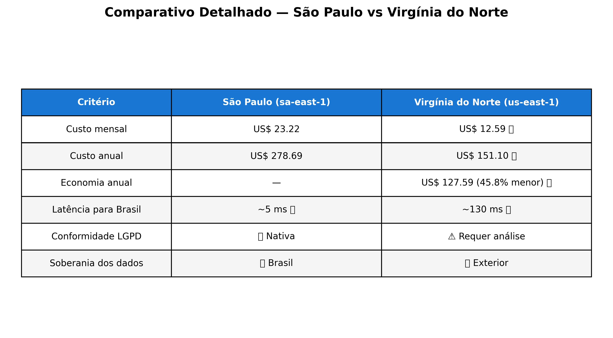
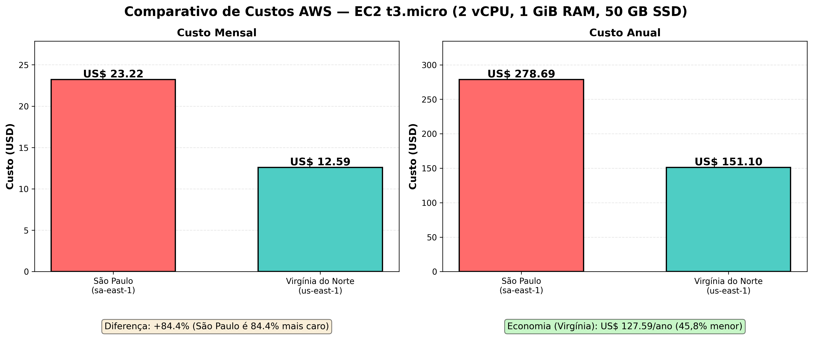

# FIAP - Faculdade de Informática e Administração Paulista

<p align="center">
<a href= "https://www.fiap.com.br/"></a>
</p>

<br>

# FarmTech Solutions — Fase 5: Machine Learning & Cloud Computing

## Grupo FarmTech Solutions

## 👨‍🎓 Integrantes: 
- <a href="https://www.linkedin.com/in/phellype-massarente-13739810a/">Phellype Matheus Giacoia Flaibam Massarente – RM566826</a>
- <a href="https://www.linkedin.com/in/carlos-costato/">Carlos Alberto Florindo Costato – RM567005</a>
- <a href="https://www.linkedin.com/in/cesar-azeredo">Cesar Martinho de Azeredo – RM568140</a>

## 👩‍🏫 Professores:
### Tutor(a) 
- <a href="https://www.linkedin.com/">Andre Godoy</a>
### Coordenador(a)
- <a href="https://www.linkedin.com/">Ana Cristina dos Santos</a>

---

## 📜 Descrição

A **FarmTech Solutions** presta serviços de Inteligência Artificial para uma fazenda de médio porte (200 hectares) que produz diversas culturas agrícolas. Neste projeto da Fase 5, desenvolvemos soluções de **Machine Learning** para análise preditiva de rendimento de safra e uma **estimativa de custos em nuvem AWS** para hospedagem da infraestrutura.

### Entrega 1 — Machine Learning: Previsão de Rendimento de Safra

Com base no dataset `crop_yield.csv`, realizamos:

1. **Análise Exploratória de Dados (EDA):** investigação das variáveis de condições de solo e temperatura relacionadas ao tipo de produto agrícola, buscando compreender distribuições, correlações e padrões nos dados.

2. **Clusterização e Detecção de Outliers (ML Não Supervisionado):** identificação de tendências de rendimento das plantações por meio de algoritmos de clusterização (K-Means, DBSCAN, etc.) e detecção de cenários discrepantes (outliers).

3. **Modelos Preditivos de Regressão (ML Supervisionado):** construção de **5 modelos preditivos** com algoritmos distintos para prever o rendimento da safra, seguindo boas práticas de projetos de Machine Learning e avaliação com métricas pertinentes.

> O notebook Jupyter completo com todo o código, análises e conclusões está disponível em: [`src/PhellypeMatheusGiacoiaFlaibamMassarente_rm566826_pbl_fase4.ipynb`](src/PhellypeMatheusGiacoiaFlaibamMassarente_rm566826_pbl_fase4.ipynb)

### Entrega 2 — Computação em Nuvem: Estimativa de Custos AWS

Estimativa de custos usando a Calculadora AWS para hospedar a Machine Learning em uma máquina Linux com as seguintes configurações:
- 2 CPUs
- 1 GiB de memória
- Até 5 Gigabit de rede
- 50 GB de armazenamento (HD)

Comparação entre as regiões **São Paulo (sa-east-1)** e **Virgínia do Norte (us-east-1)**, considerando custo On-Demand (100%), restrições legais (LGPD) e latência.

---

## 📹 Vídeos Demonstrativos

| Entrega | Vídeo | Duração |
|---------|-------|---------|
| Entrega 1 — Machine Learning | [🎬 Assistir no YouTube](https://youtube.com/LINK_DO_VIDEO_1) | ≤ 5 min |
| Entrega 2 — AWS Cloud | [🎬 Assistir no YouTube](https://youtube.com/LINK_DO_VIDEO_2) | ≤ 5 min |

---

## 📁 Estrutura de pastas

Dentre os arquivos e pastas presentes na raiz do projeto, definem-se:

- <b>.github</b>: Arquivos de configuração específicos do GitHub para gerenciar e automatizar processos no repositório.

- <b>assets</b>: Arquivos relacionados a elementos não-estruturados deste repositório, como imagens, logos e screenshots.

- <b>config</b>: Arquivos de configuração que definem parâmetros e ajustes do projeto.

- <b>document</b>: Todos os documentos do projeto, incluindo o AI Project Document. Na subpasta "other", documentos complementares.

- <b>scripts</b>: Scripts auxiliares para tarefas específicas do projeto.

- <b>src</b>: Todo o código-fonte criado para o desenvolvimento do projeto, incluindo o Notebook Jupyter com a solução completa de Machine Learning.

- <b>README.md</b>: Arquivo que serve como guia e explicação geral sobre o projeto (o mesmo que você está lendo agora).

```
📦 farmtech-solutions-fase5/
├── 📂 .github/                              ← Configurações do GitHub
├── 📂 assets/                               ← Imagens e recursos visuais
│   ├── logo-fiap.png
│   └── comparativo_custos.png               ← Gráfico comparativo AWS
├── 📂 config/                               ← Configurações do projeto
├── 📂 document/                             ← Documentação do projeto
│   ├── ai_project_document_fiap.md          ← Documento principal do projeto de IA
│   └── 📂 other/                            ← Documentos complementares
├── 📂 scripts/                              ← Scripts auxiliares
├── 📂 src/                                  ← Código-fonte
│   ├── PhellypeMatheusGiacoiaFlaibamMassarente_rm566826_pbl_fase4.ipynb ← Notebook Jupyter
│   └── crop_yield.csv                       ← Dataset
├── 📄 .gitignore
├── 📄 README.md                             ← Este arquivo
└── 📄 ROADMAP_FASE5.md                      ← Roadmap do projeto
```

---

## 🔧 Como executar o código

### Pré-requisitos

- **Python 3.9+**
- **Jupyter Notebook** ou **JupyterLab**
- Bibliotecas Python (listadas no notebook):
  - `pandas`, `numpy`, `matplotlib`, `seaborn`
  - `scikit-learn`, `xgboost` (opcional)

### Instalação

```bash
# 1. Clone o repositório
git clone https://github.com/Phemassa/FarmTech-FASE-5-cap1-2026.git
cd FarmTech-FASE-5-cap1-2026

# 2. Crie um ambiente virtual (recomendado)
python -m venv venv
source venv/bin/activate  # Linux/Mac
# venv\Scripts\activate   # Windows

# 3. Instale as dependências
pip install pandas numpy matplotlib seaborn scikit-learn xgboost jupyter

# 4. Inicie o Jupyter Notebook
jupyter notebook src/PhellypeMatheusGiacoiaFlaibamMassarente_rm566826_pbl_fase4.ipynb
```

### Execução

1. Abra o notebook Jupyter localizado em `src/`
2. Execute todas as células em ordem: **Kernel → Restart & Run All**
3. O notebook contém todas as análises, modelos e conclusões documentadas

---

## ☁️ Entrega 2 — Comparação de Custos AWS

### Configurações da Máquina

| Especificação | Valor |
|---------------|-------|
| Sistema Operacional | Linux |
| vCPUs | 2 |
| Memória RAM | 1 GiB |
| Rede | Até 5 Gigabit |
| Armazenamento | 50 GB (HDD) |
| Modelo de cobrança | On-Demand (100%) |

### Comparação: São Paulo (sa-east-1) vs Virgínia do Norte (us-east-1)

| Recurso | São Paulo (sa-east-1) | Virgínia do Norte (us-east-1) |
|---------|:--------------------:|:-----------------------------:|
| **Instância EC2** | `t3.micro` | `t3.micro` |
| vCPUs / RAM | 2 vCPUs / 1 GiB | 2 vCPUs / 1 GiB |
| **Custo EC2/hora** | US$ 0,0188 | US$ 0,0104 |
| **Custo EC2/mês** (730h) | US$ 13,72 | US$ 7,59 |
| **Armazenamento EBS** 50 GB (HDD gp2) | US$ 9,50 | US$ 5,00 |
| **Total mensal** | **US$ 23,22** | **US$ 12,59** |
| **Total anual** | **US$ 278,69** | **US$ 151,10** |
| **Economia anual** (vs SP) | — | 🟢 US$ 127,59 (45,8% menor) |

> **Fonte:** AWS Pricing — EC2 On-Demand Linux, instância `t3.micro` (2 vCPU, 1 GiB RAM), armazenamento EBS gp2 50 GB, 100% utilização mensal (730 horas).

<p align="center">
  
  <br><em>Tabela 1: Comparativo detalhado — São Paulo vs Virgínia do Norte</em>
</p>

<p align="center">
  
  <br><em>Figura 1: Comparativo de custos mensais e anuais — São Paulo vs Virgínia do Norte</em>
</p>

### Justificativa Técnica

#### 💰 Qual a solução mais barata?

A região **Virgínia do Norte (us-east-1)** é **45,8% mais barata**: US$ 12,59/mês vs US$ 23,22/mês de São Paulo — uma economia de **US$ 127,59/ano**. Isso ocorre porque:
- A AWS opera data centers na Virgínia desde 2006 com infraestrutura altamente consolidada e custos operacionais menores.
- A região us-east-1 tem o maior volume de clientes AWS do mundo, diluindo os custos fixos de operação.
- O Brasil enfrenta custos mais altos de energia, impostos sobre importação de equipamentos e infraestrutura de conectividade.

#### ⚖️ Qual opção escolher considerando todas as restrições?

| Critério | São Paulo (sa-east-1) | Virgínia do Norte (us-east-1) |
|----------|:---------------------:|:-----------------------------:|
| Custo mensal | US$ 23,22 | US$ 12,59 ✅ |
| Latência para sensores no Brasil | ~5 ms ✅ | ~130 ms ❌ |
| Conformidade LGPD | ✅ Nativa | ⚠️ Requer análise |
| Soberania dos dados | ✅ Dados no Brasil | ❌ Dados no exterior |
| Disponibilidade (SLA EC2) | 99,99% | 99,99% |

**1. Latência:** Os sensores ESP32 estão fisicamente no Brasil. Latência de ~5 ms (SP) vs ~130 ms (Virgínia) impacta diretamente a responsividade do sistema de monitoramento em tempo real — crítico para alertas de irrigação e condições climáticas.

**2. LGPD (Lei nº 13.709/2018):** A Lei Geral de Proteção de Dados estabelece que dados pessoais e dados sensíveis de operações em território brasileiro devem ser tratados com garantias equivalentes à legislação brasileira. Transferências internacionais de dados são permitidas, mas exigem mecanismos adicionais de proteção (cláusulas contratuais, consentimento explícito). Hospedar os dados no Brasil elimina essa complexidade jurídica.

**3. Soberania e controle:** Manter os dados operacionais (telemetria de solo, produtividade, coordenadas geográficas da fazenda) em data centers nacionais reduz riscos regulatórios e garante acesso ininterrupto mesmo em cenários de mudanças em políticas internacionais.

#### ✅ Decisão Final: **São Paulo (sa-east-1)**

Apesar do custo 45,8% superior, a região São Paulo é a escolha **tecnicamente e legalmente recomendada** para este projeto, pelos seguintes motivos:

- **Conformidade LGPD nativa** — sem necessidade de mecanismos jurídicos adicionais para transferência internacional de dados.
- **Latência mínima** (~5 ms) — essencial para o processamento em tempo real dos dados dos sensores IoT no campo.
- **Soberania dos dados agrícolas** — informações estratégicas da fazenda permanecem sob jurisdição brasileira.
- **Custo adicional justificado** — a diferença de US$ 127,59/ano (~R$ 640/ano) é insignificante frente ao custo de adequação regulatória e ao risco operacional de alta latência.

> **Regra prática:** use us-east-1 para workloads puramente globais sem dados sensíveis; use sa-east-1 quando latência para usuários brasileiros e conformidade LGPD forem requisitos.

---

## 🚀 Ir Além (Opcional)

### Opção 1: ESP32 + Wi-Fi + Sensores

**Status:** 🔄 Em progresso

**Descrição:** Implementação de coleta de dados agrícolas com ESP32, leitura periódica de sensores e envio em JSON para API HTTP na AWS.

**Sensores utilizados:**
- DHT22 (temperatura e umidade do ar)
- Sensor de umidade do solo (analógico)

**Justificativa:** combinação de baixo custo e alta aplicabilidade para monitoramento de irrigação e estresse hídrico, cobrindo variáveis ambientais e de solo.

**Arquitetura (fase atual):**
- ESP32 lê sensores locais
- ESP32 conecta no Wi-Fi
- ESP32 envia payload JSON para API HTTP na AWS (`sa-east-1`)
- Backend persiste e disponibiliza os dados

**Código-fonte:** [src/esp32](src/esp32)

**Vídeo demonstrativo:** pendente (será adicionado ao concluir integração fim a fim)

---

## 🗃 Histórico de lançamentos

* 0.3.0 - A definir
    * Entrega final: gravação dos vídeos, links YouTube e submissão no portal FIAP
* 0.2.0 - 12/03/2026
    * Entrega 2: estimativa de custos AWS (sa-east-1 vs us-east-1), gráfico comparativo e justificativa técnica (LGPD + latência)
* 0.1.0 - 12/03/2026
    * Entrega 1: notebook Jupyter com EDA completa, clusterização (K-Means, DBSCAN, Hierarchical), 5 modelos de regressão e comparação de métricas

---

## 📋 Licença

<p xmlns:cc="http://creativecommons.org/ns#" xmlns:dct="http://purl.org/dc/terms/"><a property="dct:title" rel="cc:attributionURL" href="https://github.com/agodoi/template">MODELO GIT FIAP</a> por <a rel="cc:attributionURL dct:creator" property="cc:attributionName" href="https://fiap.com.br">Fiap</a> está licenciado sobre <a href="http://creativecommons.org/licenses/by/4.0/?ref=chooser-v1" target="_blank" rel="license noopener noreferrer" style="display:inline-block;">Attribution 4.0 International</a>.</p>
