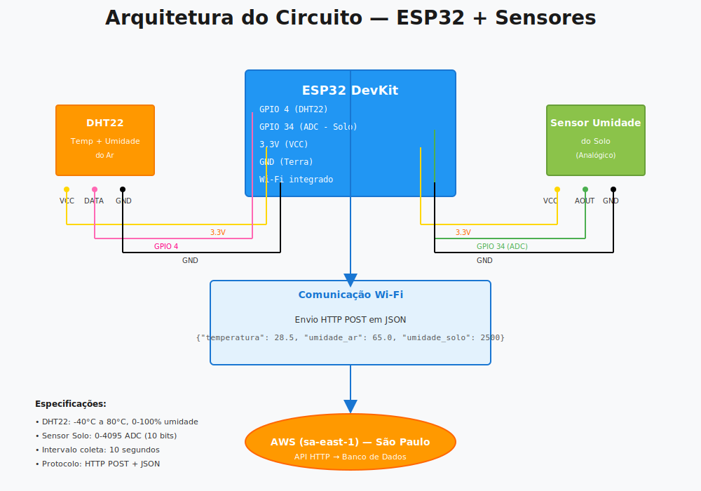

# ESP32 + IoT (EP-06)

Implementação inicial da **Opção 1** do "Ir Além": coleta de sensores com ESP32 + envio via Wi-Fi.

## Arquitetura do Circuito

<p align="center">
  
  <br><em>Figura: Arquitetura do circuito — ESP32 + DHT22 + Sensor de Umidade do Solo</em>
</p>

## Especificações dos Sensores

**DHT22 (Temperatura & Umidade do Ar):**
- Faixa de temperatura: -40°C a 80°C
- Faixa de umidade: 0-100%
- Protocolo: 1-Wire digital
- Pino: GPIO 4

**Sensor de Umidade do Solo (Analógico):**
- Faixa de leitura: 0-4095 (ADC 10-bit)
- Tipo: capacitivo analógico
- Pino: GPIO 34

## Arquivos
- `main.cpp`: leitura dos sensores + envio HTTP periódico
- `simulator.py`: simulação de leituras ESP32 + envio HTTP para API
- `platformio.ini`: configuração para build/upload com PlatformIO (VS Code)

## Execução com PlatformIO (VS Code)

### Pré-requisitos
- Extensão **PlatformIO IDE** instalada no VS Code
- ESP32 conectado via USB (para upload em hardware real)

### Passo a passo
1. Abrir a pasta `src/esp32` no VS Code como projeto
2. Ajustar em `main.cpp`:
	- `WIFI_SSID`
	- `WIFI_PASSWORD`
	- `API_URL`
3. Rodar build:

```bash
cd src/esp32
pio run
```

4. Fazer upload para a placa:

```bash
cd src/esp32
pio run -t upload
```

5. Abrir monitor serial:

```bash
cd src/esp32
pio device monitor -b 115200
```

### Simulação sem hardware
Caso não tenha ESP32 físico no momento, usar:

```bash
python src/esp32/simulator.py
```

## Implementação prática (alinhada ao backlog)

### 1) Simulação do circuito (T-06.1.3 / T-06.2.1)
No Wokwi, monte:
- ESP32 DevKit
- DHT22 no pino `GPIO 4`
- Sensor de umidade do solo (analógico) no pino `GPIO 34`

### 2) Firmware no ESP32 (T-06.2.2 / T-06.2.3 / T-06.2.4)
1. Abrir `main.cpp`
2. Configurar:
	- `WIFI_SSID`
	- `WIFI_PASSWORD`
	- `API_URL`
3. Compilar e subir no ESP32 (Arduino IDE / PlatformIO)

### 3) Teste sem hardware físico (T-06.2.5)
Use o simulador local para validar a API:

```bash
python src/esp32/simulator.py
```

Por padrão, ele envia 5 leituras para `http://localhost:8000/sensores`.

## Critérios de aceite sugeridos
- ESP32 conectado ao Wi-Fi
- Leitura periódica de temperatura, umidade do ar e umidade do solo
- Payload JSON recebido pela API HTTP
- Logs de sucesso/falha de envio no serial (ESP32) ou terminal (simulador)
